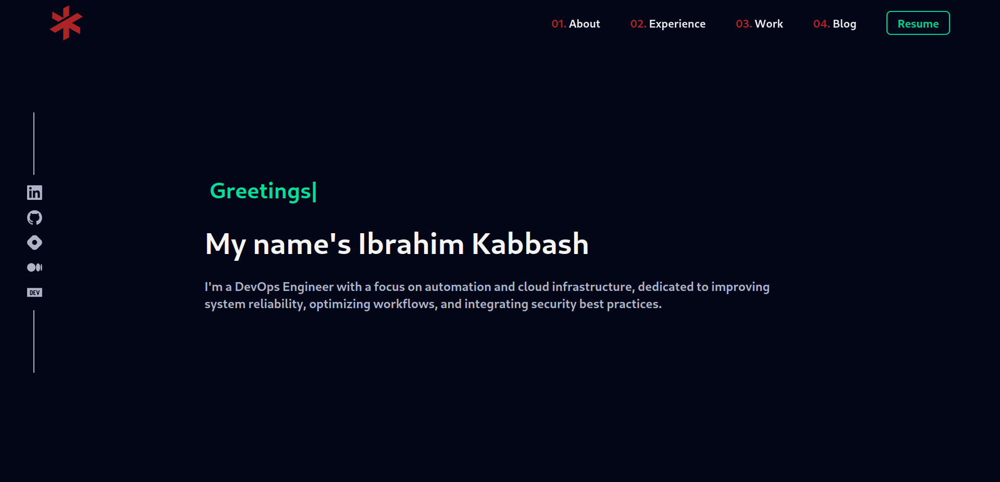

<div align="center">
    
</div>
<h1 align="center">
    ikabbash.com
</h1>
<p align="center">
    A personal portfolio website showcasing my experience, skills, and technical journey.
</p>
<p align="center">
    Built with <a href="https://react.dev/" target="_blank">React</a>,
    <a href="https://tailwindcss.com/docs/installation/using-vite" target="_blank">Tailwindcss</a>, and hosted with
    <a href="https://pages.cloudflare.com/" target="_blank">Cloudflare Pages</a>.
</p>
<p align="center">
    <a >
        
    </a>
</p>
<!-- <p align="center">
    <a >
        
    </a>
</p> -->



## Getting Started
1. Install dependencies
    ```
    npm install
    ```
2. Run the app
    ```
    npm run dev
    ```
3. Access through the browser using `localhost:3000`

### Running with Docker
To deploy and run the application in a containerized environment, build the Docker image and start the container with the following command:
```
docker build -t portfolio .
docker run -p 8080:80 portfolio
```

## Color Reference  
| Color          | Hex        |
| -------------- | ---------- |
| Background     | `#020617`  |
| Text 1        | `#f5f5f5`  |
| Text 2        | `#aeb4c8`  |
| Text 3        | `#8892b0`  |
| Primary       | `#b52626`  |
| Secondary     | `#00df9a`  |
| Card          | `#0B0F21`  |
| Tag           | `#111827`  |

## References
- https://apidocs.hashnode.com/#definition-Post
- https://gql.hashnode.com/
- https://tailwindcss.com/blog/tailwindcss-v4#css-theme-variables
- https://vite.dev/guide/static-deploy#cloudflare-pages-with-git